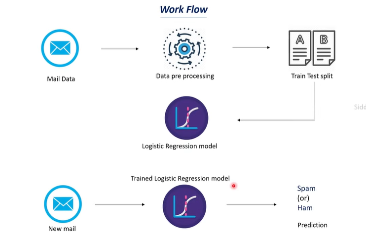

**Work Flow**
Mail Data --> Data Preprocessing --> Train Test Split --> Logistic Regression Model --> Trained Logistic Regression Model --> when get new Mail --> Verdict Spam or not Spam


------------------------------------------------------------

Explanation of separating data as texts and labels:

```python
X = mail_data['Message']  # Input: All email messages
y = mail_data['Category'] # Output: 1 for ham, 0 for spam
```

That's it! This simple separation:
- `X` contains all the email messages we'll analyze
- `y` contains the corresponding labels (1=ham, 0=spam)

This separation is essential because:
1. Machine learning models need input (X) and output (y) clearly separated
2. We'll use X to train the model to predict y
3. Later, we'll use this to train/test split and convert text to numbers

-------------------------------------------------------------

Breaking down the `TfidfVectorizer` line and explain each parameter:

```python
feature_extraction = TfidfVectorizer(min_df=1, stop_words='english', lowercase=True)
```

This line creates a TF-IDF (Term Frequency-Inverse Document Frequency) vectorizer, which converts text data into numerical features. Let's understand each parameter:

1. `TfidfVectorizer`: 
   - Converts text into numerical features
   - Calculates how important a word is in a document relative to other documents
   - Creates a matrix where:
     - Each row represents a document (email in your case)
     - Each column represents a unique word
     - The values represent the importance of each word

2. Parameters:
   - `min_df=1`: 
     - Minimum document frequency
     - Words must appear in at least 1 document to be included
     - If set to 2, words appearing in only one document would be ignored
   
   - `stop_words='english'`:
     - Removes common English words like "the", "is", "at", "which", "on"
     - These words don't add meaningful information for classification
     - Helps reduce noise in the data
   
   - `lowercase=True`:
     - Converts all text to lowercase
     - Makes the analysis case-insensitive
     - "SPAM" and "spam" will be treated as the same word

This is a crucial step in your spam detection project because:
1. Machine learning models can't work with text directly
2. TF-IDF converts your email messages into numbers
3. These numbers represent the importance of words in each email
4. The model can then use these numbers to learn patterns that distinguish spam from legitimate emails


--------------------------------------------------------------

Explain these two important lines of code:

```python
X_train_features = feature_extraction.fit_transform(X_train)
X_test_features = feature_extraction.transform(X_test)
```

These lines convert your text data into numerical features. Let's break them down:

1. `X_train_features = feature_extraction.fit_transform(X_train)`:
   - `fit_transform()` does two things:
     1. `fit()`: Learns the vocabulary from your training data
     2. `transform()`: Converts the text into numerical features
   - This is done on training data because we want to learn the patterns from it
   - The result is a matrix where:
     - Each row is an email
     - Each column is a unique word
     - The values are TF-IDF scores (how important each word is)

2. `X_test_features = feature_extraction.transform(X_test)`:
   - Only uses `transform()` (not `fit_transform()`)
   - Uses the vocabulary learned from training data
   - Converts test data using the same rules
   - This is important because:
     - We don't want to learn new patterns from test data
     - Test data should be processed the same way as training data
     - This ensures fair evaluation of the model

The difference between these two lines is crucial:
- Training data: `fit_transform()` (learn + convert)
- Test data: `transform()` (only convert)


--------------------------------------------------


Let me explain the difference between `predict()` and `fit()`:

1. `model.fit(X_train_features, y_train)`:
   - This is used to TRAIN the model
   - It learns the patterns from your training data
   - It's like teaching the model what spam and ham emails look like
   - You only do this once during training

2. `model.predict(X_train_features)`:
   - This is used to MAKE PREDICTIONS
   - It uses the trained model to predict whether an email is spam or ham
   - It doesn't learn anything new, it just applies what it learned during training
   - You can use this multiple times to make predictions

In your code:
```python
# First, train the model
model.fit(X_train_features, y_train)

# Then, make predictions using the trained model
prediction_on_training_data = model.predict(X_train_features)
```

The sequence is important:
1. First, you train the model with `fit()`
2. Then, you can use `predict()` to make predictions
3. You can't use `predict()` before `fit()`
4. You don't need to `fit()` again unless you want to retrain the model

Think of it like this:
- `fit()` is like studying for an exam
- `predict()` is like taking the exam
- You need to study first before you can take the exam
- You can take multiple exams using what you learned during studying


----------------------------------------------------------


Let me explain overfitting and underfitting in the context of your spam detection model:

Looking at your model's accuracy scores:
```python
Accuracy on training data :  0.9676912721561588  # 96.77%
Accuracy on test data :  0.9668161434977578     # 96.68%
```

Your model is actually performing very well and is NOT overfitting! Here's why:

1. **Overfitting** occurs when:
   - Training accuracy is much higher than test accuracy
   - Model learns the training data too well, including noise
   - Model fails to generalize to new data
   - Example: If training accuracy was 99% but test accuracy was 70%

2. **Underfitting** occurs when:
   - Both training and test accuracy are low
   - Model fails to learn patterns in the data
   - Model is too simple
   - Example: If both accuracies were around 60%

3. **Good Fit** (what your model has):
   - Training and test accuracies are similar
   - Both accuracies are high
   - Model generalizes well to new data
   - Your model: 96.77% training vs 96.68% test

Your model is showing a good fit because:
- The difference between training and test accuracy is very small (0.09%)
- Both accuracies are high (above 96%)
- The model is generalizing well to unseen data


